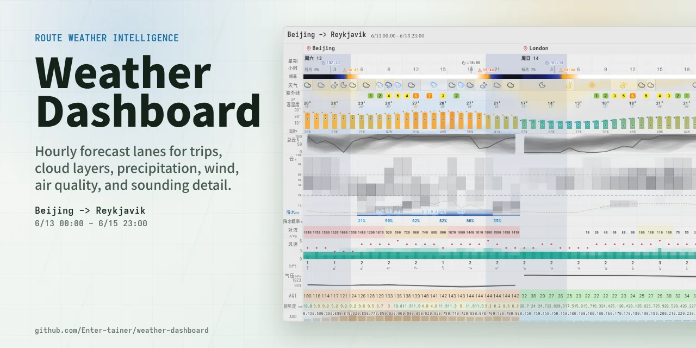

# Weather Dashboard / 天气面板

<picture>
  <source media="(prefers-color-scheme: dark)" srcset="./og-image-dark.webp">
  <source media="(prefers-color-scheme: light)" srcset="./og-image-light.webp">
  
</picture>

A [Windy](https://www.windy.com/)-style weather dashboard built with React + Canvas. All data comes from [Open-Meteo](https://open-meteo.com/) (free, no API key needed).

一个类 [Windy](https://www.windy.com/) 风格的天气面板，用 React + Canvas 画的，数据全部来自 [Open-Meteo](https://open-meteo.com/)（免费，不需要 API key）。

The focus is on **information density** — ensemble forecasts, CAPE, cloud layers, pressure fields, all stacked on a single horizontally-scrollable timeline.

重点在于**信息密度**——集合预报、CAPE、云层分层、气压场，全部堆在一条可以横向滚动的时间轴上。

## Features / 主要功能

- **Multi-city itinerary** — chain "Beijing 3 days → London 4 days" in one unbroken scroll
- **多城市行程拼接** — 在 URL 里写好「北京 3 天 → 伦敦 4 天」，一条时间轴滚到底

- **Ensemble forecasts** — auto-selects ECMWF / ICON / GFS by forecast range, draws uncertainty bands & spaghetti lines
- **集合预报** — 根据预报时距自动选 ECMWF / ICON / GFS 模型，画出不确定性区间和 spaghetti 线

- **CAPE heatmap** — convective risk at a glance
- **CAPE 热力图** — 对流风险一目了然

- **UV index** — color-coded by safety level
- **UV 指数** — 按安全等级自动着色

- **Cloud layers** — high / mid / low clouds rendered independently
- **云层分层** — 高 / 中 / 低云独立渲染

- **Precipitation** — probability (%) side-by-side with volume (mm)
- **降水** — 概率 (%) 和降水量 (mm) 并排对照

- **Wind** — Beaufort scale blocks + gust peaks
- **风力** — 蒲福风级色块 + 阵风峰值

- **Sunrise / sunset shading** — uses real sunrise/sunset times, not a naive 18:00–06:00 cutoff
- **日出日落着色** — 用真实 sunrise/sunset 时间画夜间阴影，不是 18:00–06:00 一刀切

- **Compact mode** — `?compact=1` collapses low-priority lanes (temperature, clouds, CAPE, pressure) into a dense single-scroll view; precipitation shows volume bars & wind shows Beaufort + arrow per cell
- **紧凑模式** — `?compact=1` 折叠温度、云层、CAPE、气压等次要图表，降水显示量级条、风力显示蒲福级+风向箭头；适合快速扫视

- **Long-range fallback** — beyond 15 days, auto-switches from deterministic models to ensemble mean
- **远期降级** — 超过 15 天自动从确定性模型切到集合均值，不会直接报错

## Tech Stack / 技术栈

React 19 + Vite. Charts are hand-drawn on Canvas 2D (hundreds of semi-transparent ensemble lines — DOM can't handle it). Layout via CSS Flexbox, icons from Lucide React.

React 19 + Vite，图表用 Canvas 2D 手绘（集合预报几百条半透明线，DOM 扛不住），布局用 CSS Flexbox，图标用 Lucide React。

## URL Parameters / URL 参数

Everything is configured via the `route` query parameter. No login, no config files.

所有配置都通过 URL 的 `route` 参数传，不需要登录也不需要配置文件。

### Format / 格式

```
?route=location[~displayName]:date;location[~displayName]:date;...
```

- **location**: city name (`Beijing`, `上海`, etc.) or coordinates (`35.68,139.69`)
- **位置**：城市名（`Beijing`、`上海` 都行）或经纬度（`35.68,139.69`）

- **~displayName**: optional, overrides the label shown on the chart
- **~显示名**：可选，用来覆盖图表上方显示的地名

- **date**: `YYYY-MM-DD`
- **日期**：`YYYY-MM-DD`

Entries are separated by `;`.

条目之间用 `;` 隔开。

### Examples / 举几个例子

Single city, next few days: / 一个城市，看未来几天：
```
/?route=Shanghai:2026-03-28
```

Multi-city trip, stitched together: / 出差行程，三段拼在一起：
```
/?route=Beijing:2026-03-24;London:2026-03-27;New%20York:2026-03-30
```

Coordinates with a custom display name: / 用坐标定位，顺便自定义显示名：
```
/?route=35.68,139.69~东京:2026-03-28
```

Two cities on the same date — a toggle button appears for quick comparison: / 同一天挂两个城市，界面上会出现切换按钮，方便对比：
```
/?route=Beijing~北京:2026-03-28;Shanghai~上海:2026-03-28
```

### `compact` — Toggle compact mode / 紧凑模式

Add `&compact=1` to collapse secondary lanes (temperature, clouds, CAPE, pressure) and show a condensed dashboard — precipitation bars and wind Beaufort indicators remain for quick weather scanning.

加 `&compact=1` 折叠次要图表（温度、云层、CAPE、气压），保留降水和风力摘要，适合快速浏览。

### Without parameters / 不传参数的话

The app tries browser geolocation first (reverse-geocoded via Nominatim). If that fails, defaults to Beijing, showing the next 7 days.

会先尝试浏览器定位拿你当前坐标（Nominatim 反查地名），拿不到就默认显示北京未来 7 天。

## Getting Started / 本地开发

```bash
pnpm install
pnpm dev
```

Open the URL printed in the terminal (usually `localhost:5174`). Add `?route=...` to the address bar to switch cities.

打开终端输出的地址（一般是 `localhost:5174`），在地址栏加 `?route=...` 就能切换城市。

Build output is fully static: / 构建产物是纯静态的：

```bash
pnpm build    # outputs to dist/  输出到 dist/
```

## Deployment / 部署

Pure frontend, no backend. Drop it on any static host: / 纯前端，没有后端，随便丢到静态托管上：

- **Vercel** — import repo, set framework to Vite / 导入仓库，框架选 Vite
- **Netlify** — Build command `pnpm build`, Publish directory `dist`
- **GitHub Pages** — run build via Actions / 用 Actions 跑一下 build 就好

Geocoding is done client-side via Open-Meteo's `/v1/search` — no extra backend needed.

地名解析是客户端直接调 Open-Meteo 的 `/v1/search` 完成的，不需要额外服务。
