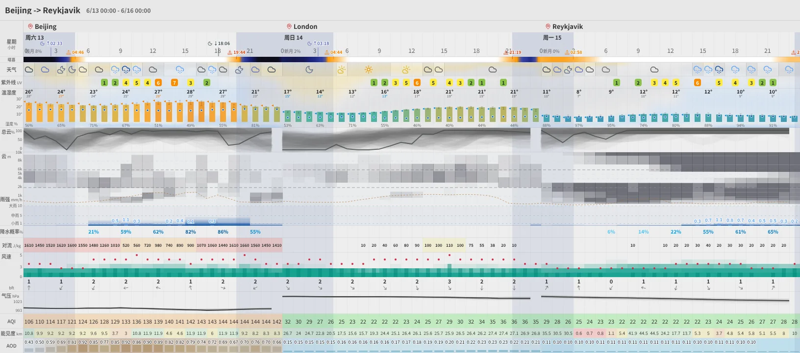
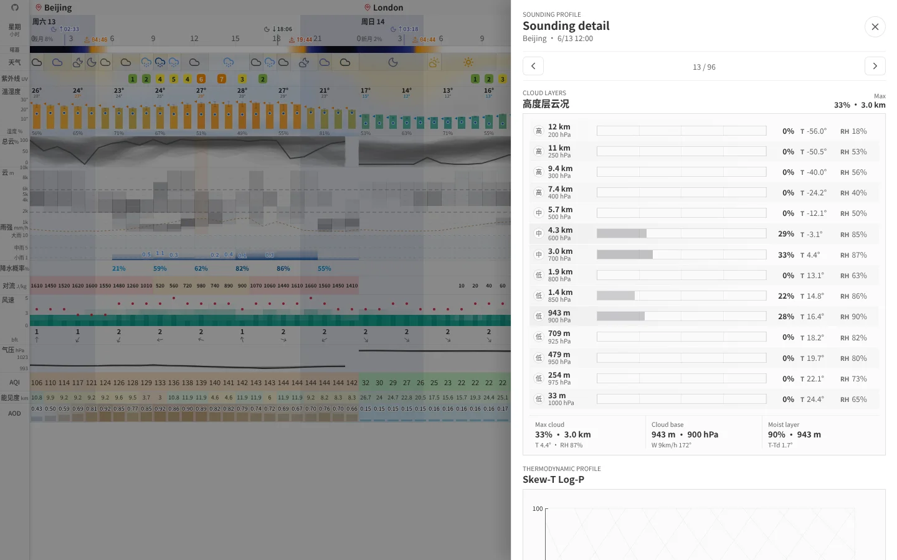
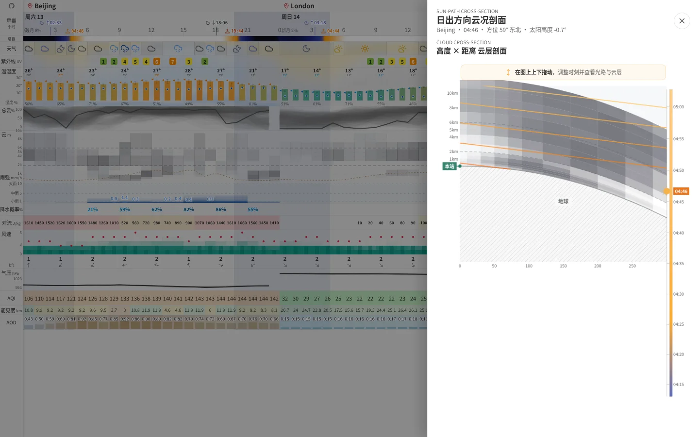

# Weather Dashboard / 天气面板

<picture>
  <source media="(prefers-color-scheme: dark)" srcset="./og-image-dark.webp">
  <source media="(prefers-color-scheme: light)" srcset="./og-image-light.webp">
  
</picture>

A [Windy](https://www.windy.com/)-style weather dashboard built with React + Canvas. Forecast data comes from [Open-Meteo](https://open-meteo.com/); current two-hour, 5-minute precipitation details come from [QWeather](https://www.qweather.com/).

一个类 [Windy](https://www.windy.com/) 风格的天气面板，用 React + Canvas 画的。常规预报来自 [Open-Meteo](https://open-meteo.com/)，当前两小时的 5 分钟降水明细来自[和风天气](https://www.qweather.com/)。

The focus is on **information density** — ensemble forecasts, CAPE, cloud layers, pressure fields, all stacked on a single horizontally-scrollable timeline.

重点在于**信息密度**——集合预报、CAPE、云层分层、气压场，全部堆在一条可以横向滚动的时间轴上。

## Screenshots / 界面截图

### Multi-city forecast timeline / 多城市预报时间轴

<picture>
  <source media="(prefers-color-scheme: dark)" srcset="./demo-dark.webp">
  <source media="(prefers-color-scheme: light)" srcset="./demo-light.webp">
  
</picture>

### Cloud layers and Skew-T sounding / 云层与 Skew-T 探空

Click any hour in the cloud lane to inspect the vertical cloud profile and thermodynamic sounding.

点击云层区域中的任一小时，可以查看垂直云层分布和热力学探空图。

<picture>
  <source media="(prefers-color-scheme: dark)" srcset="./feature-sounding-dark.webp">
  <source media="(prefers-color-scheme: light)" srcset="./feature-sounding-light.webp">
  
</picture>

### Sunrise and sunset cloud cross-section / 日出日落方向云况剖面

Click a sunrise or sunset marker to look along the solar bearing; drag vertically to move through twilight and inspect the standard-atmosphere refracted light path through cloud layers.

点击日出或日落标记，可以沿太阳方位查看云层剖面；在图上纵向拖动可调整时刻，观察按标准大气折射弯曲的曙暮光线穿过不同云层的路径。

<picture>
  <source media="(prefers-color-scheme: dark)" srcset="./feature-sun-cloud-dark.webp">
  <source media="(prefers-color-scheme: light)" srcset="./feature-sun-cloud-light.webp">
  
</picture>

## Features / 主要功能

- **Multi-city itinerary** — chain "Beijing 3 days → London 4 days" in one unbroken scroll
- **多城市行程拼接** — 在 URL 里写好「北京 3 天 → 伦敦 4 天」，一条时间轴滚到底

- **Ensemble forecasts** — auto-selects ECMWF / ICON / GFS by forecast range, draws uncertainty bands & spaghetti lines
- **集合预报** — 根据预报时距自动选 ECMWF / ICON / GFS 模型，画出不确定性区间和 spaghetti 线

- **CAPE heatmap** — convective risk at a glance
- **CAPE 热力图** — 对流风险一目了然

- **UV index** — color-coded by safety level
- **UV 指数** — 按安全等级自动着色

- **Cloud layers** — high / mid / low clouds rendered independently
- **云层分层** — 高 / 中 / 低云独立渲染

- **Skew-T sounding detail** — click any cloud-lane hour to inspect pressure-level clouds, temperature/dew-point profiles, wind, and inversions
- **Skew-T 探空详情** — 点击云层区域中的任一小时，查看气压层云况、温度/露点廓线、风场和逆温层

- **Precipitation** — probability (%) side-by-side with volume (mm)
- **降水** — 概率 (%) 和降水量 (mm) 并排对照

- **Minutely precipitation** — click either of the two precipitation cells marked `5m` to expand one continuous two-hour QWeather chart; screenshot export preserves the expanded chart
- **分钟级降水** — 点击降水行里带 `5m` 提示的任一单元格，直接在原时间轴中展开连续两小时的和风天气明细；截图导出会保留展开结果

- **Wind** — Beaufort scale blocks + gust peaks
- **风力** — 蒲福风级色块 + 阵风峰值

- **Sunrise / sunset shading** — uses real sunrise/sunset times, not a naive 18:00–06:00 cutoff
- **日出日落着色** — 用真实 sunrise/sunset 时间画夜间阴影，不是 18:00–06:00 一刀切

- **Sun-path cloud cross-section** — click sunrise/sunset markers to inspect cloud layers along the solar bearing, with a draggable twilight timeline and standard-atmosphere refraction applied consistently to shadow geometry and optical depth
- **太阳方向云况剖面** — 点击日出/日落标记，沿太阳方位查看云层，并通过可拖动的曙暮时间轴调整时刻；地影和光学厚度统一考虑标准大气折射

- **Air quality and aerosols** — AQI, estimated visibility, and aerosol optical depth share the same trip timeline
- **空气质量与气溶胶** — AQI、估算能见度和气溶胶光学厚度与行程天气显示在同一条时间轴上

- **Screenshot export** — select and resize a timeline range, then export the complete chart as PNG
- **截图导出** — 在时间轴上选择并调整范围，然后导出完整 PNG 图表

- **Compact mode** — `?compact=1` collapses low-priority lanes (temperature, clouds, CAPE, pressure) into a dense single-scroll view; precipitation shows volume bars & wind shows Beaufort + arrow per cell
- **紧凑模式** — `?compact=1` 折叠温度、云层、CAPE、气压等次要图表，降水显示量级条、风力显示蒲福级+风向箭头；适合快速扫视

- **Time compact mode** — `?timeCompact=3` or `?timeCompact=6` groups the timeline into 3-hour or 6-hour columns for long-range screenshots; it can be combined with `?compact=1`
- **时间紧凑模式** — `?timeCompact=3` 或 `?timeCompact=6` 把横轴聚合成 3 小时/6 小时一格，适合长时间截图；可以和 `?compact=1` 叠加使用

- **Long-range fallback** — beyond 15 days, auto-switches from deterministic models to ensemble mean
- **远期降级** — 超过 15 天自动从确定性模型切到集合均值，不会直接报错

## Tech Stack / 技术栈

React 19 + Vite. Charts are hand-drawn on Canvas 2D (hundreds of semi-transparent ensemble lines — DOM can't handle it). Layout via CSS Flexbox, icons from Lucide React.

React 19 + Vite，图表用 Canvas 2D 手绘（集合预报几百条半透明线，DOM 扛不住），布局用 CSS Flexbox，图标用 Lucide React。

## URL Parameters / URL 参数

Everything is configured via the `route` query parameter. No login, no config files.

所有配置都通过 URL 的 `route` 参数传，不需要登录也不需要配置文件。

### Format / 格式

```
?route=location[~displayName]:date;location[~displayName]:date;...
```

- **location**: city name (`Beijing`, `上海`, etc.) or coordinates (`35.68,139.69`)
- **位置**：城市名（`Beijing`、`上海` 都行）或经纬度（`35.68,139.69`）

- **~displayName**: optional, overrides the label shown on the chart
- **~显示名**：可选，用来覆盖图表上方显示的地名

- **date**: `YYYY-MM-DD`
- **日期**：`YYYY-MM-DD`

Entries are separated by `;`.

条目之间用 `;` 隔开。

### Examples / 举几个例子

Single city, next few days: / 一个城市，看未来几天：

```
/?route=Shanghai:2026-03-28
```

Multi-city trip, stitched together: / 出差行程，三段拼在一起：

```
/?route=Beijing:2026-03-24;London:2026-03-27;New%20York:2026-03-30
```

Coordinates with a custom display name: / 用坐标定位，顺便自定义显示名：

```
/?route=35.68,139.69~东京:2026-03-28
```

Two cities on the same date — a toggle button appears for quick comparison: / 同一天挂两个城市，界面上会出现切换按钮，方便对比：

```
/?route=Beijing~北京:2026-03-28;Shanghai~上海:2026-03-28
```

### `compact` — Toggle compact mode / 紧凑模式

Add `&compact=1` to collapse secondary lanes (temperature, clouds, CAPE, pressure) and show a condensed dashboard — precipitation bars and wind Beaufort indicators remain for quick weather scanning.

加 `&compact=1` 折叠次要图表（温度、云层、CAPE、气压），保留降水和风力摘要，适合快速浏览。

### `timeCompact` — Compress time columns / 时间轴紧凑模式

Use `&timeCompact=3` or `&timeCompact=6` to aggregate hourly data into 3-hour or 6-hour columns. This reduces screenshot width while keeping each rendered column readable.

用 `&timeCompact=3` 或 `&timeCompact=6` 把小时数据聚合成 3 小时/6 小时一格。这样会减少截图宽度，但每一格仍保持正常列宽，天气图标和 UV 不会挤在一起。

It can be combined with vertical compact mode, for example `&compact=1&timeCompact=3`.

它可以和纵向紧凑模式组合，例如 `&compact=1&timeCompact=3`。

### `layout=reader` — Physical-size reader layout / 实体屏阅读布局

Use `&layout=reader&location=Shanghai~上海` for an always-on high-DPI tablet or E-ink weather
screen. `location` uses the same location syntax as `route`: a city, coordinates, and an optional
`~displayName`, but no date. Reader mode generates dates automatically, refreshes the forecast,
and reclaims completed hourly columns while keeping the current hour. It uses roughly 24 visible
hours in portrait and 32 in landscape on a 1404×1872 display at DPR 1.5. Combine it with
`&display=eink` for monochrome rendering and `&immersive=true` to hide floating controls.

常驻高 DPI 平板或墨水屏使用 `&layout=reader&location=Shanghai~上海`。`location` 与 `route`
的地点语法一致，支持城市、经纬度和可选 `~显示名`，但不需要日期。阅读模式会自动生成日期、
刷新预报，并保留当前小时、回收已经结束的小时列；在 1404×1872、DPR 1.5 的屏幕上，竖屏
一屏约 24 小时，横屏约 32 小时。可以配合 `&display=eink` 使用黑白渲染，并通过
`&immersive=true` 隐藏悬浮按钮。

### Without parameters / 不传参数的话

The app tries browser geolocation first (reverse-geocoded via Nominatim). If that fails, defaults to Beijing, showing the next 7 days.

会先尝试浏览器定位拿你当前坐标（Nominatim 反查地名），拿不到就默认显示北京未来 7 天。

## Getting Started / 本地开发

```bash
pnpm install
pnpm dev
```

Open the URL printed in the terminal (usually `localhost:5174`). Add `?route=...` to the address bar to switch cities.

打开终端输出的地址（一般是 `localhost:5174`），在地址栏加 `?route=...` 就能切换城市。

### Update README screenshots / 更新 README 截图

```bash
pnpm demo:update
```

This regenerates the overview, sounding, and sun-path screenshots in both light and dark themes from `fixtures/default.json`. The sun-path capture uses a deterministic response inside the screenshot script, so it does not depend on live forecast availability. Pass `--features 0` to `scripts/capture-screenshot.ts` when only the overview pair is needed.

该命令会基于 `fixtures/default.json` 重新生成亮色、暗色两套总览图、探空图和太阳方向云况剖面。太阳剖面在截图脚本中使用固定响应，不依赖实时预报是否可用；如果只需生成总览图，可以给 `scripts/capture-screenshot.ts` 传入 `--features 0`。

### Test QWeather BYOK locally / 本地测试和风 BYOK

1. Open a route containing today and a location in China, for example `/?route=Beijing~北京:YYYY-MM-DD`.
2. Open the gear menu, find **QWeather Minutely Precipitation (BYOK)**, and enter your API Key and dedicated API Host.
3. Keep **Remember in this browser** off to use `sessionStorage`, or enable it to use `localStorage`.
4. Save the credential, then click either of the two precipitation cells marked `5m`. They expand together as one continuous 5-minute chart; use the × action to collapse it again.

中文步骤：

1. 打开包含今天及中国地点的路线，例如 `/?route=Beijing~北京:YYYY-MM-DD`。
2. 打开齿轮设置，在**和风天气分钟降水 (BYOK)** 中填写自己的 API Key 与专属 API Host。
3. 不勾选“记住在此浏览器”时使用 `sessionStorage`；勾选后使用 `localStorage`。
4. 保存凭证，然后点击当前小时或下一小时上的降水图标。

The API Key is sent directly from the browser to the user's QWeather API Host via the `X-QW-Api-Key` header. It is never sent to this project's server. Like any browser-stored credential, it can be read by JavaScript running on the same origin, so avoid persistent storage on shared devices.

API Key 由浏览器通过 `X-QW-Api-Key` 请求头直接发送到用户自己的和风 API Host，不经过本项目服务器。与所有浏览器内凭证一样，同源 JavaScript 可以读取它，因此不要在共享设备上持久保存。

Build output is fully static: / 构建产物是纯静态的：

```bash
pnpm build    # outputs to dist/  输出到 dist/
```

## Deployment / 部署

The build is fully static. Deploy `dist/` to any static host, or use the included Wrangler command for Cloudflare Workers Static Assets:

构建结果是纯静态文件，可以把 `dist/` 部署到任意静态托管平台，也可以使用 Wrangler 部署到 Cloudflare Workers Static Assets：

```bash
pnpm deploy
```

Geocoding is done client-side via Open-Meteo's `/v1/search` — no extra backend needed.

地名解析是客户端直接调 Open-Meteo 的 `/v1/search` 完成的，不需要额外服务。
